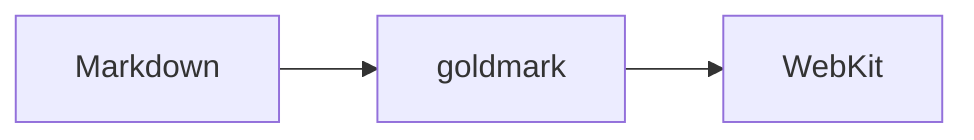

# mdview Testdokument

Dieses Dokument enthält **fast alles**, was Markdown kann. Es dient als Rendering-Test für *mdview*.

## 1. Textformatierung

**fett**, *kursiv*, ***fett und kursiv***, ~~durchgestrichen~~, `Inline-Code`, <mark>HTML-mark</mark>, H<sub>2</sub>O, E = mc<sup>2</sup>.

Ein Absatz mit hartem Umbruch (zwei Leerzeichen)  
in der nächsten Zeile. Sonderzeichen: ä ö ü ß € — „Anführungszeichen“ … → ✓ 🚀

Escapes: \*kein kursiv\*, \# keine Überschrift, \`kein Code\`.

### Überschrift 3
#### Überschrift 4
##### Überschrift 5
###### Überschrift 6

Setext-Überschrift
==================

Setext Ebene 2
--------------

---

## 2. Listen

- Punkt A
- Punkt B
  - Verschachtelt B.1
  - Verschachtelt B.2
    - Noch tiefer
- Punkt C

1. Erster
2. Zweiter
   1. Unter-Punkt
   2. Unter-Punkt
3. Dritter

Gemischt:

1. Schritt eins
   - Detail
   - Noch ein Detail
2. Schritt zwei

Lose Liste mit Absätzen:

- Erster Punkt

  Zweiter Absatz im selben Punkt.

- Zweiter Punkt

### Aufgabenliste

- [x] Markdown parsen
- [x] HTML rendern
- [ ] Live-Reload
- [ ] Dark Mode

## 3. Links & Bilder

- [Inline-Link](https://example.com "mit Titel")
- [Referenz-Link][ref]
- Auto-Link: https://www.trailto.life
- <https://example.com/spitze-klammern>
- E-Mail: <hallo@example.com>

[ref]: https://example.com/referenz

Relatives Bild (aus `testdata/`):


Bild als data-URI:


## 4. Code

Inline: `fmt.Println("Hallo")`

```go
package main

import "fmt"

func main() {
	for i := 0; i < 3; i++ {
		fmt.Printf("Zeile %d\n", i)
	}
}
```

```python
def fib(n: int) -> int:
    return n if n < 2 else fib(n - 1) + fib(n - 2)
```

```bash
$ mdview testdata/test.md
```

Eingerückter Codeblock:

    kein Sprachtag
    vier Leerzeichen davor

## 5. Zitate

> Ein einfaches Zitat.
>
> Mit zweitem Absatz.
>
> > Verschachteltes Zitat
> > über zwei Zeilen.
>
> - Liste im Zitat
> - noch ein Punkt
>
> ```
> Code im Zitat
> ```

## 6. Tabellen

| Sprache | Typisierung | Kompiliert | Stars |
|:--------|:-----------:|:----------:|------:|
| Go      | statisch    | ja         | 120k  |
| Python  | dynamisch   | nein       | 60k   |
| Rust    | statisch    | ja         | 95k   |
| `bash`  | keine       | nein       | —     |

## 7. Rohes HTML

<details>
<summary>Aufklappbarer Bereich (HTML)</summary>

Versteckter Inhalt mit **Markdown** darin.

</details>

<div style="padding:1em;background:#fff3cd;border:1px solid #ffe08a;border-radius:6px">
Gelbe Box aus reinem HTML.
</div>

<kbd>Strg</kbd> + <kbd>Q</kbd> beendet mdview.

<!-- Dieser Kommentar ist unsichtbar. -->

## 8. Nicht aktivierte Erweiterungen

Diese Dinge sind in `render.go` **nicht** aktiviert und erscheinen daher roh:

Fußnote[^1] und eine zweite[^note].

[^1]: Text der Fußnote.
[^note]: Noch eine Fußnote.

Begriff
: Definition (Definition List)

Mathe: $E = mc^2$ und

$$
\int_0^\infty e^{-x^2}\,dx = \frac{\sqrt{\pi}}{2}
$$



Emoji-Shortcode :tada: bleibt Text.

---

*Ende des Testdokuments.*
