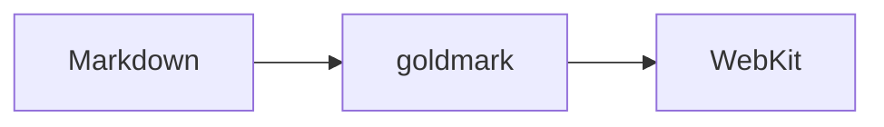

# mdview test document

This document contains **almost everything** Markdown can do. It serves as a
rendering test for *mdview* and as a showcase of what is and is not supported.

## 1. Text formatting

**bold**, *italic*, ***bold and italic***, ~~strikethrough~~, `inline code`,
<mark>HTML mark</mark>, H<sub>2</sub>O, E = mc<sup>2</sup>.

A paragraph with a hard line break (two trailing spaces)  
on the next line. Special characters: ä ö ü ß € — “quotation marks” … → ✓ 🚀

Escapes: \*not italic\*, \# not a heading, \`not code\`.

### Heading 3
#### Heading 4
##### Heading 5
###### Heading 6

Setext heading
==============

Setext level 2
--------------

---

## 2. Lists

- Item A
- Item B
  - Nested B.1
  - Nested B.2
    - Even deeper
- Item C

1. First
2. Second
   1. Sub-item
   2. Sub-item
3. Third

Mixed:

1. Step one
   - Detail
   - Another detail
2. Step two

Loose list with paragraphs:

- First item

  Second paragraph in the same item.

- Second item

### Task list

- [x] Parse Markdown
- [x] Render HTML
- [x] Live reload
- [ ] Dark mode

## 3. Links and images

- [Inline link](https://example.com "with title") (blocked: links cannot be clicked)
- [Reference link][ref]
- Autolink: https://www.example.org
- <https://example.com/angle-brackets>
- Email: <hello@example.com>

[ref]: https://example.com/reference

Relative image (from `testdata/`):


Image as data URI:


## 4. Code

Inline: `fmt.Println("Hello")`

```go
package main

import "fmt"

func main() {
	for i := 0; i < 3; i++ {
		fmt.Printf("Line %d\n", i)
	}
}
```

```python
def fib(n: int) -> int:
    return n if n < 2 else fib(n - 1) + fib(n - 2)
```

```bash
$ mdview testdata/test.md
```

Indented code block:

    no language tag
    four spaces in front

## 5. Blockquotes

> A simple quote.
>
> With a second paragraph.
>
> > A nested quote
> > spanning two lines.
>
> - A list in a quote
> - another item
>
> ```
> Code in a quote
> ```

## 6. Tables

| Language | Typing  | Compiled | Stars |
|:---------|:-------:|:--------:|------:|
| Go       | static  | yes      | 120k  |
| Python   | dynamic | no       | 60k   |
| Rust     | static  | yes      | 95k   |
| `bash`   | none    | no       | —     |

## 7. Raw HTML

<details>
<summary>Collapsible section (HTML)</summary>

Hidden content with **Markdown** inside.

</details>

<div style="padding:1em;background:#fff3cd;border:1px solid #ffe08a;border-radius:6px">
Yellow box made of plain HTML.
</div>

<kbd>Ctrl</kbd> + <kbd>Q</kbd> quits mdview.

<!-- This comment is invisible. -->

## 8. Security checks

Raw HTML is passed through, so these must all be **neutralised** by the
viewer. If any of them works, something is wrong:

<script>document.body.style.background = "red";</script>


<a href="javascript:document.body.style.background='red'">javascript: link (must do nothing)</a>

The page background must stay white, and the next line must not redirect the
window anywhere:

<meta http-equiv="refresh" content="0;url=https://example.com/">

## 9. Extensions that are not enabled

These are not enabled in `render.go` and therefore appear as plain text:

Footnote[^1] and a second one[^note].

[^1]: Text of the footnote.
[^note]: Another footnote.

Term
: Definition (definition list)

Math: $E = mc^2$ and

$$
\int_0^\infty e^{-x^2}\,dx = \frac{\sqrt{\pi}}{2}
$$



Emoji shortcode :tada: stays text.

---

*End of the test document.*
